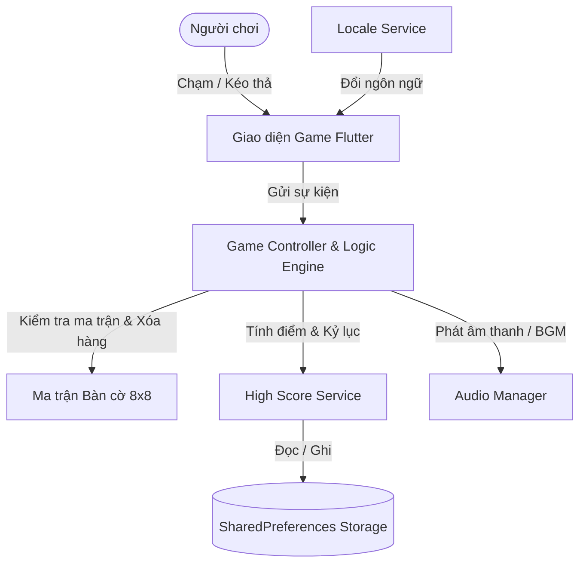
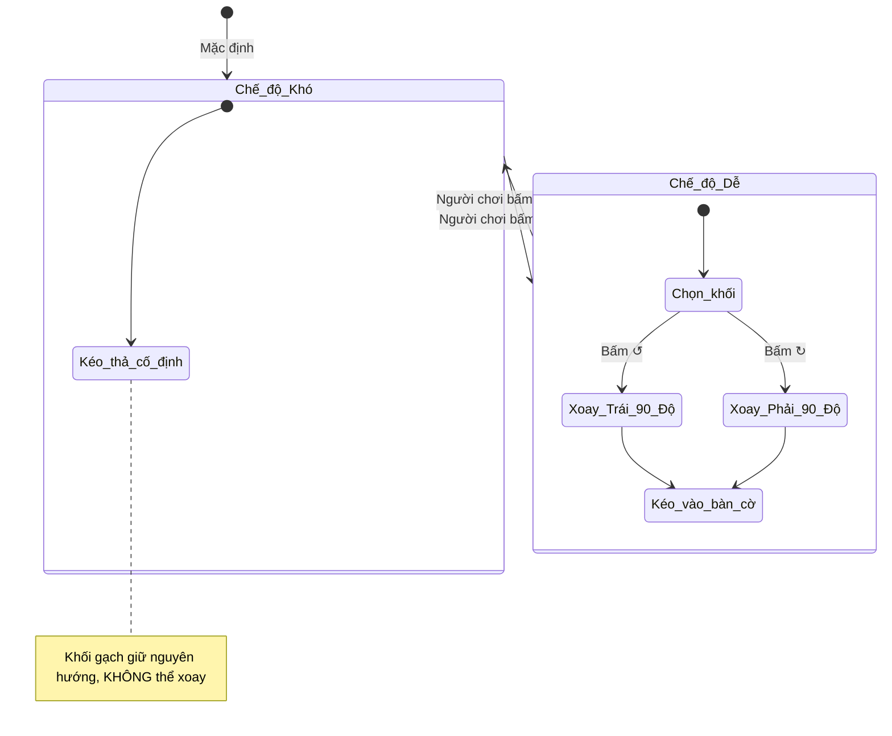
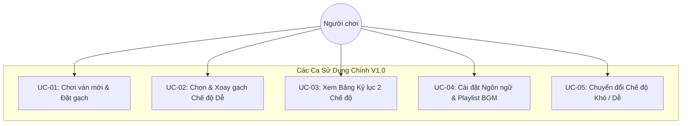

# TÀI LIỆU ĐẶC TẢ YÊU CẦU PHẦN MỀM (SRS)
## DỰ ÁN: BLOCK PUZZLE GAME (PHIÊN BẢN 1.0 - OFFLINE STANDALONE)

---

| Thông tin dự án | Chi tiết |
| :--- | :--- |
| **Tên sản phẩm** | Block Puzzle Game |
| **Mã phiên bản** | Version 1.0.0 (Offline Standalone) |
| **Nền tảng mục tiêu** | iOS, Android, Windows Desktop, Web |
| **Công nghệ phát triển** | Flutter SDK & Dart Language |
| **Chuẩn tham chiếu** | IEEE 830 / ISO/IEC/IEEE 29148 Standard for SRS |
| **Trạng thái tài liệu** | Chính thức (Approved / Baseline) |

---

## MỤC LỤC
1. [GIỚI THIỆU CHUNG (INTRODUCTION)](#1-giới-thiệu-chung-introduction)
2. [TỔNG QUAN SẢN PHẨM & MÔI TRƯỜNG VẬN HÀNH (OVERALL DESCRIPTION)](#2-tổng-quan-sản-phẩm--môi-trường-vận-hành-overall-description)
3. [YÊU CẦU CHỨC NĂNG CHI TIẾT (FUNCTIONAL REQUIREMENTS)](#3-yêu-cầu-chức-năng-chi-tiết-functional-requirements)
4. [YÊU CẦU PHI CHỨC NĂNG (NON-FUNCTIONAL REQUIREMENTS)](#4-yêu-cầu-phi-chức-năng-non-functional-requirements)
5. [ĐẶC TẢ CA SỬ DỤNG (USE CASE SCENARIOS)](#5-đặc-tả-ca-sử-dụng-use-case-scenarios)
6. [MA TRẬN TRUY VẾT YÊU CẦU (REQUIREMENTS TRACEABILITY MATRIX)](#6-ma-trận-truy-vết-yêu-cầu-requirements-traceability-matrix)

---

## 1. GIỚI THIỆU CHUNG (INTRODUCTION)

### 1.1. Mục đích tài liệu (Purpose)
Tài liệu này đặc tả chi tiết toàn bộ các yêu cầu nghiệp vụ, yêu cầu chức năng (Functional Requirements) và yêu cầu phi chức năng (Non-Functional Requirements) cho sản phẩm **Block Puzzle Game (Phiên bản 1.0)**. Tài liệu đóng vai trò là kim chỉ nam kỹ thuật cho việc phát triển, kiểm thử, nghiệm thu và làm cơ sở vững chắc để phát triển mở rộng lên Phiên bản 2.0 (Online Multiplayer / Cloud Sync).

### 1.2. Phạm vi sản phẩm (Product Scope)
* **Loại hình sản phẩm:** Trò chơi điện tử giải đố xếp hình khối (Block Puzzle Game).
* **Mô hình vận hành V1.0:** Ngoại tuyến hoàn toàn (100% Standalone Offline), không phụ thuộc vào kết nối mạng Internet hay máy chủ Backend.
* **Tính năng cốt lõi:**
  * Bàn cờ giải đố ma trận $8 \times 8$.
  * 2 Chế độ chơi: **Chế độ Khó (Hard Mode)** cố định hướng gạch cổ điển và **Chế độ Dễ (Easy Mode)** cho phép xoay gạch $90^\circ$.
  * Tương tác kéo thả công thái học chuẩn cao (Hitbox $96 \times 96\text{ px}$, Nâng khối $50\text{ px}$ chống che ngón tay).
  * Hệ thống xóa hàng/cột, Multi-line và nhân điểm chuỗi Combo liên hoàn.
  * Bảng xếp hạng kỷ lục cục bộ phân tách riêng biệt cho từng chế độ.
  * Hệ thống âm thanh phong phú: 5 bài nhạc nền BGM ngẫu nhiên kèm khoảng lặng 5s và bộ hiệu ứng âm thanh SFX.
  * Hỗ trợ 3 ngôn ngữ giao diện: Tiếng Việt, Tiếng Anh, Tiếng Nhật.

### 1.3. Thuật ngữ và Định nghĩa (Definitions & Acronyms)

| Thuật ngữ | Định nghĩa / Ý nghĩa |
| :--- | :--- |
| **Grid / Board** | Ma trận bàn cờ $8 \times 8$ gồm 64 ô vuông để đặt các khối gạch. |
| **Block / Shape** | Khối gạch hình học được tạo thành từ 1 đến nhiều ô vuông đơn vị (ví dụ: $1 \times 1, 1 \times 4, 3 \times 3, \text{chữ L, T, Z...}$). |
| **Hand Tray** | Khay đựng 3 khối gạch chờ ở phía dưới màn hình để người chơi chọn kéo vào bàn cờ. |
| **Hitbox** | Vùng diện tích tiếp nhận cảm ứng chạm của ngón tay người dùng trên màn hình. |
| **touchLift** | Khoảng cách nâng cao hình ảnh khối gạch ($50\text{ px}$) so với tọa độ chạm của ngón tay khi đang kéo, tránh bị ngón tay che khuất tầm nhìn. |
| **Snap Tolerance** | Dung sai khoảng cách tâm cho phép khối gạch tự động "hút" và khớp vào các ô hợp lệ trên bàn cờ. |
| **Combo / Streak** | Chuỗi ăn điểm liên tiếp qua các lượt đặt gạch liên tục. |
| **BGM / SFX** | *Background Music* (Nhạc nền) / *Sound Effects* (Hiệu ứng âm thanh tương tác). |
| **HIG / Material** | *Apple Human Interface Guidelines* ($44\text{ pt}$) và *Google Material Design Guidelines* ($48\text{ dp}$). |

---

## 2. TỔNG QUAN SẢN PHẨM & MÔI TRƯỜNG VẬN HÀNH (OVERALL DESCRIPTION)

### 2.1. Mô hình vận hành hệ thống V1.0
Ứng dụng được thiết kế theo kiến trúc **Client-Only Single Process**:
* Dữ liệu trò chơi, điểm số, cài đặt âm thanh và ngôn ngữ được lưu trữ hoàn toàn trên bộ nhớ cục bộ của thiết bị thông qua `SharedPreferences`.
* Vòng lặp trò chơi (Game Loop), thuật toán kiểm tra va chạm, thuật toán quét hàng và tính điểm diễn ra tức thời trên luồng chính của client với độ trễ xấp xỉ 0ms.

### 2.2. Môi trường thực thi & Thiết bị đích
* **Hệ điều hành Di động:**
  * **iOS:** Phiên bản iOS 12.0 trở lên (Tương thích iPhone SE, iPhone 11/12/13/14/15/16 series, iPad).
  * **Android:** Phiên bản Android 6.0 (API Level 23) trở lên, tương thích mọi độ phân giải màn hình từ chuẩn 16:9 đến 21:9.
* **Hệ điều hành Máy tính & Trình duyệt:**
  * **Windows Desktop:** Windows 10/11 (x64).
  * **Web:** Các trình duyệt hiện đại hỗ trợ WebAssembly & HTML5 Canvas (Chrome, Safari, Edge, Firefox).

### 2.3. Ràng buộc thiết kế & Thực thi (Design Constraints)
1. **Ràng buộc công nghệ:** Phát triển hoàn toàn trên nền tảng **Flutter SDK (Channel Stable $\ge 3.47.x$)** và ngôn ngữ **Dart ($\ge 3.13.x$)**.
2. **Ràng buộc chuẩn chạm (Accessibility):** Kích thước điểm chạm tương tác tối thiểu phải tuân thủ chuẩn $\ge 48 \times 48\text{ px}$ để loại bỏ triệt để hiện tượng "ngón tay béo" (Fat-finger syndrome).
3. **Ràng buộc ngoại tuyến:** Ứng dụng không được phép phát sinh bất kỳ yêu cầu mạng (Network Request) nào ở phiên bản V1.0; đảm bảo khởi động và chơi mượt mà ngay cả khi thiết bị ở chế độ máy bay (Airplane Mode).

---

## 3. YÊU CẦU CHỨC NĂNG CHI TIẾT (FUNCTIONAL REQUIREMENTS)

### FR-01: Bàn cờ & Ma trận trạng thái (Board & Grid Management)
* **FR-01.1:** Hệ thống phải duy trì một ma trận bàn cờ có kích thước cố định **$8 \times 8$ ô vuông** (tổng cộng 64 ô).
* **FR-01.2:** Mỗi ô cờ phải hiển thị rõ ràng 1 trong 3 trạng thái thị giác:
  1. *Ô trống:* Nền tối viền mảnh, thể hiện vị trí chưa có gạch.
  2. *Ô đã có gạch:* Tô màu gradient theo màu của khối đã đặt, có hiệu ứng đổ bóng phát sáng (Glow).
  3. *Ô xem trước (Placement Preview):* Hiển thị bóng mờ có màu của khối đang rê ngón tay tới, giúp người chơi biết trước vị trí sẽ rơi vào.
* **FR-01.3:** Tọa độ bàn cờ được đánh chỉ số từ `(row: 0..7, col: 0..7)`.

---

### FR-02: Cơ chế Khay gạch & Kéo thả (Hand Tray & Drag-Drop Mechanics)
* **FR-02.1:** Khay chờ dưới cùng luôn hiển thị tối đa **3 khối gạch ứng viên**.
* **FR-02.2:** Khi người chơi đặt hết toàn bộ 3 khối trong khay vào bàn cờ, hệ thống phải tự động sinh ngẫu nhiên 3 khối mới (Refill) ngay lập tức.
* **FR-02.3 (Công thái học Chạm):** Mỗi ô chứa khối trong khay có kích thước khung đỡ cố định $96 \times 96\text{ px}$. Toàn bộ diện tích $96 \times 96\text{ px}$ này phải là vùng tiếp nhận điểm chạm (`HitTestBehavior.opaque`), đảm bảo các khối nhỏ $1 \times 1$ hoặc thanh mỏng $1 \times 5$ đều nhận cảm ứng kéo/chọn tức thì 100%.
* **FR-02.4 (Chống che khuất ngón tay):** Khi khối gạch được nhấc lên kéo đi, tâm hình ảnh của khối phải được nâng cao hơn điểm tiếp xúc ngón tay một khoảng cách `touchLift = 50.0 px`.
* **FR-02.5 (Snap Hút ô thông minh):** Khi kéo khối gạch vào bàn cờ, hệ thống tính khoảng cách Euclid giữa tâm khối gạch và tâm vị trí ô cờ hợp lệ gần nhất. Nếu khoảng cách $\le 0.5 \times \text{kích thước ô}$, hệ thống tự động hiển thị bóng mờ xem trước (Preview) và cho phép thả gạch ăn ngay vào vị trí đó.

---

### FR-03: Hai Chế độ chơi (Game Modes)
Hệ thống cung cấp 2 chế độ chơi độc lập, có thể chuyển đổi linh hoạt qua nút gạt tại màn hình chính:

* **FR-03.1 (Chế độ Khó - Hard Mode):**
  * Giữ nguyên luật chơi Block Puzzle truyền thống: Các khối gạch sinh ra có góc xoay cố định, người chơi **không thể xoay** khối.
* **FR-03.2 (Chế độ Dễ - Easy Mode):**
  * Khi ở chế độ Dễ, người chơi chạm vào bất kỳ khối nào trong khay để chọn khối đó (khối được highlight viền xanh neon $12\text{ px}$).
  * Thanh công cụ xoay xuất hiện với 2 nút chức năng:
    * **Xoay trái (↺ Rotate Left):** Xoay ma trận khối ngược chiều kim đồng hồ $90^\circ$.
    * **Xoay phải (↻ Rotate Right):** Xoay ma trận khối thuận chiều kim đồng hồ $90^\circ$.
  * Sau khi xoay đến hướng ưng ý, người chơi kéo thả khối vào bàn cờ bình thường.

---

### FR-04: Quy tắc Xóa hàng, Tính điểm & Hệ thống Combo (Scoring & Combo)
* **FR-04.1 (Điểm đặt gạch):** Mỗi khi đặt thành công một khối gạch vào bàn cờ, người chơi nhận được số điểm bằng **tổng số ô vuông đơn vị** cấu thành nên khối đó (Ví dụ: khối $3 \times 3$ được cộng $+9$ điểm, thanh $1 \times 5$ được cộng $+5$ điểm).
* **FR-04.2 (Xóa hàng/cột):**
  * Ngay sau khi đặt gạch, hệ thống tự động kiểm tra toàn bộ 8 hàng ngang và 8 cột dọc.
  * Mọi hàng hoặc cột nào có đủ $8/8$ ô đã lấp đầy sẽ bị xóa sạch trở về ô trống.
  * Điểm thưởng xóa hàng: $10 \text{ điểm} \times \text{số hàng/cột bị xóa}$.
* **FR-04.3 (Thưởng xóa nhiều hàng đồng thời - Multi-line Clear Bonus):**
  * Nếu một nước đi xóa từ 2 hàng/cột trở lên cùng lúc, người chơi được cộng thêm điểm thưởng bội số:
    $$\text{Bonus Multi-line} = (\text{Số đường} - 1) \times 15\text{ điểm}$$
* **FR-04.4 (Hệ thống Combo Streak):**
  * Nếu người chơi thực hiện các nước đi liên tiếp mà nước nào cũng xóa được ít nhất 1 hàng/cột, chỉ số Combo tăng dần ($2, 3, 4, 5...$).
  * Điểm thưởng Combo được nhân thêm: $\text{Bonus Combo} = \text{Combo} \times 10\text{ điểm}$.
  * Giao diện hiển thị huy hiệu rực lửa động `Combo xN 🔥` ở khu vực điểm số.
  * Nếu một nước đi đặt gạch mà không xóa được hàng nào, chỉ số Combo sẽ được thiết lập lại về $0$.

---

### FR-05: Điều kiện Kết thúc ván (Game Over Detection)
* **FR-05.1:** Sau mỗi nước đi (hoặc sau khi xoay khối ở chế độ Dễ), hệ thống tự động chạy thuật toán quét ma trận:
  * Kiểm tra xem còn bất kỳ vị trí `(row, col)` nào trên bàn cờ $8 \times 8$ có thể đặt vừa **dù chỉ 1 trong các khối gạch còn lại trong khay** hay không.
* **FR-05.2:** Nếu không còn bất kỳ khối gạch nào trong khay có thể đặt được vào bàn cờ:
  1. Trạng thái ván chơi chuyển thành **Game Over**.
  2. Phát âm thanh kết thúc ván.
  3. Tự động kiểm tra điểm số: Nếu điểm số hiện tại lớn hơn kỷ lục cao nhất của chế độ đó, phát âm thanh `newrecord.mp3` và bật Hộp thoại Kỷ lục mới (`NewRecordDialog`).
  4. Nếu không phá kỷ lục, hiển thị Hộp thoại Thua cuộc (`GameOverDialog`) kèm nút "Chơi lại".

---

### FR-06: Hệ thống Bảng Kỷ lục Cục bộ (Local Leaderboard & High Score)
* **FR-06.1 (Phân tách độc lập theo chế độ):**
  * Hệ thống lưu trữ và quản lý **2 bảng kỷ lục hoàn toàn tách biệt**: Bảng kỷ lục Chế độ Khó và Bảng kỷ lục Chế độ Dễ.
  * Điểm số đạt được ở chế độ Khó tuyệt đối không được gộp hay ảnh hưởng đến chế độ Dễ và ngược lại.
* **FR-06.2 (Top 10 Kỷ lục):**
  * Mỗi chế độ lưu giữ danh sách **Top 10 ván chơi có điểm cao nhất**.
  * Mỗi bản ghi kỷ lục gồm: `Thứ hạng (Top 1..10)`, `Điểm số (Score)`, `Thời gian đạt được (Timestamp định dạng dd/MM/yyyy HH:mm)`.
* **FR-06.3 (Giao diện Bảng Kỷ lục):**
  * Nút bấm biểu tượng Cúp vàng 🏆 trên thanh công cụ cho phép mở `LeaderboardDialog`.
  * Hộp thoại có 2 Tab chuyển đổi: **"🔥 Khó"** và **"✨ Dễ"** để người chơi dễ dàng xem thành tích của từng chế độ.

---

### FR-07: Hệ thống Âm thanh & Nhạc nền (Audio Subsystem)
* **FR-07.1 (Nhạc nền - BGM Engine):**
  * Tích hợp sẵn danh mục 5 bài nhạc nền thư giãn (`bgm1.mp3` đến `bgm5.mp3`).
  * Cơ chế phát ngẫu nhiên (Random Shuffle) tuần tự giữa các bài hát được kích hoạt trong cài đặt.
  * **Khoảng lặng nghỉ (Silence Gap):** Sau khi kết thúc mỗi bài nhạc nền, hệ thống tự động dừng nghỉ đúng **5 giây** trước khi chuyển sang bài tiếp theo, mang lại cảm giác thư thái, không gây mệt mỏi thính giác.
* **FR-07.2 (Hiệu ứng Âm thanh - SFX Engine):**
  * Tích hợp âm thanh tương tác tức thời:
    * `drop.wav`: Âm thanh khi đặt thành công khối gạch.
    * `clear.wav`: Âm thanh giòn tan khi một hoặc nhiều hàng/cột bị xóa.
    * `newrecord.mp3`: Âm thanh hân hoan khi phá kỷ lục điểm cao nhất.
* **FR-07.3 (Quản lý Nhanh):** Nút bật/tắt nhạc nhanh trên thanh công cụ cho phép tắt/bật toàn bộ BGM chỉ với 1 chạm.

---

### FR-08: Hỗ trợ Đa ngôn ngữ (Localization - i18n)
* **FR-08.1:** Hệ thống hỗ trợ hoàn chỉnh 3 ngôn ngữ quốc tế:
  1. 🇻🇳 **Tiếng Việt (Mặc định)**
  2. 🇬🇧 **English**
  3. 🇯🇵 **日本語**
* **FR-08.2:** Khi người dùng thay đổi ngôn ngữ trong Cài đặt, toàn bộ văn bản trên giao diện (Điểm số, Kỷ lục, Nút bấm, Bảng xếp hạng, Hướng dẫn xoay, Hộp thoại Game Over...) lập tức được dịch sang ngôn ngữ mới mà không cần khởi động lại ứng dụng.

---

### FR-09: Hộp thoại Cài đặt (Settings Modal)
* **FR-09.1 (Giao diện Cài đặt):** Bấm nút bánh răng ⚙️ trên thanh công cụ để mở `SettingsDialog`.
* **FR-09.2 (Chọn ngôn ngữ):** Cung cấp 3 nút chọn ngôn ngữ trực quan có gắn cờ biểu tượng (🇻🇳 Tiếng Việt, 🇬🇧 English, 🇯🇵 日本語).
* **FR-09.3 (Quản lý Playlist BGM):**
  * Liệt kê danh sách cả 5 bài nhạc nền.
  * Mỗi bài hát có 1 công tắc (Switch/Checkbox) cho phép người chơi bật/tắt riêng lẻ từng bài theo sở thích cá nhân.
  * Trình phát nhạc chỉ chọn phát ngẫu nhiên các bài được tick bật.

---

## 4. YÊU CẦU PHI CHỨC NĂNG (NON-FUNCTIONAL REQUIREMENTS)

### NFR-01: Hiệu năng & Tốc độ đáp ứng (Performance)
* **Tốc độ khung hình (Frame Rate):** Ứng dụng phải duy trì ổn định ở mức **60 FPS** (hoặc 120 FPS trên màn hình ProMotion / 120Hz), không xảy ra hiện tượng giật cục (Jank/Stutter) khi thực hiện animation xóa hàng.
* **Thời gian khởi động (Startup Time):** Ứng dụng phải hiển thị màn hình chơi game trong thời gian dưới **1.5 giây** từ khi mở app.
* **Mức tiêu thụ tài nguyên:** Dung lượng RAM chiếm dụng khi chơi liên tục dưới **120 MB**, không gây nóng máy hoặc hao pin bất thường.

### NFR-02: Công thái học & Trải nghiệm chạm (Ergonomics & Accessibility)
* Mọi nút bấm và phần tử tương tác ngón tay đều có diện tích tiếp nhận cảm ứng tối thiểu **$\ge 48 \times 48\text{ px}$**, tuân thủ tiêu chuẩn Apple HIG và Google Material Design.
* Cơ chế `touchLift = 50px` giúp ngón tay của người chơi không bao giờ che khuất khối gạch hay các ô cờ bên dưới khi đang kéo thả.

### NFR-03: Giao diện Đáp ứng (Responsive UI & Cross-Platform)
* Giao diện phải tự động co giãn và căn chỉnh linh hoạt:
  * Trên các dòng điện thoại có bề ngang hẹp (như iPhone SE, iPhone 16) hoặc tỷ lệ màn hình dài: Thanh công cụ trên cùng không bị tràn, các nút không bị che khuất hay đè lên nhau.
  * Trên máy tính bảng, màn hình gập (Foldables) hoặc cửa sổ Desktop: Bàn cờ tự động căn giữa và giới hạn kích thước tối đa hợp lý ($420\text{ px}$).

### NFR-04: Tính toàn vẹn & Lưu trữ Dữ liệu (Data Persistence & Reliability)
* Toàn bộ điểm kỷ lục, ngôn ngữ đã chọn và cấu hình playlist nhạc phải được tự động ghi vào `SharedPreferences` ngay khi có thay đổi.
* Nếu ứng dụng bị đóng đột ngột (tắt nguồn, cuộc gọi đến, người dùng vuốt thoát app), dữ liệu đã lưu không bao giờ bị mất hoặc hư hỏng (Corruption-free).

---

## 5. ĐẶC TẢ CA SỬ DỤNG (USE CASE SCENARIOS)

### 5.1. UC-01: Chơi ván mới & Đặt gạch vào bàn cờ
* **Tác nhân:** Người chơi.
* **Tiền điều kiện:** Ứng dụng đang ở màn hình chính, khay có sẵn các khối gạch.
* **Luồng sự kiện chính:**
  1. Người chơi chạm ngón tay vào 1 trong 3 ô khối gạch trong khay chờ.
  2. Người chơi giữ và kéo ngón tay về phía bàn cờ $8 \times 8$. Khối gạch phóng to về kích thước chuẩn và bay cao hơn ngón tay $50\text{ px}$.
  3. Khi rê đến gần vị trí hợp lệ, bàn cờ hiển thị bóng mờ xem trước (Preview).
  4. Người chơi nhấc ngón tay ra để thả gạch.
  5. Hệ thống đặt gạch vào bàn cờ, phát âm thanh `drop.wav`, cộng điểm đặt gạch.
  6. Hệ thống kiểm tra các hàng/cột đầy: Nếu có, thực hiện xóa hàng, phát âm thanh `clear.wav`, cộng điểm thưởng và tăng chỉ số Combo.
  7. Nếu 3 khối trong khay đã được đặt hết, hệ thống tự động sinh 3 khối mới.
  8. Hệ thống kiểm tra điều kiện kết thúc ván.

### 5.2. UC-02: Chọn và Xoay gạch ở Chế độ Dễ
* **Tác nhân:** Người chơi.
* **Tiền điều kiện:** Ứng dụng đang bật ở "Chế độ Dễ (Easy Mode)".
* **Luồng sự kiện chính:**
  1. Người chơi chạm nhẹ vào 1 khối gạch trong khay.
  2. Khối gạch được viền màu xanh neon nổi bật; thanh công cụ với nút **Xoay Trái (↺)** và **Xoay Phải (↻)** xuất hiện.
  3. Người chơi bấm nút Xoay Trái hoặc Xoay Phải một hoặc nhiều lần để xoay khối gạch $90^\circ$ theo mong muốn.
  4. Người chơi chạm giữ và kéo khối đã xoay vào bàn cờ để đặt gạch như UC-01.

### 5.3. UC-03: Xem Bảng Kỷ lục 2 Chế độ
* **Tác nhân:** Người chơi.
* **Luồng sự kiện chính:**
  1. Người chơi chạm vào nút Cúp Vàng 🏆 ở góc trên bên trái màn hình.
  2. Hộp thoại `LeaderboardDialog` hiển thị với 2 Tab: "🔥 Khó" và "✨ Dễ".
  3. Hệ thống hiển thị danh sách Top 10 điểm cao nhất của Tab đang chọn.
  4. Người chơi chuyển đổi qua lại giữa 2 Tab để tra cứu thành tích.
  5. Người chơi bấm nút "Đóng" để quay lại ván chơi.

### 5.4. UC-04: Cài đặt Ngôn ngữ & Playlist Nhạc nền
* **Tác nhân:** Người chơi.
* **Luồng sự kiện chính:**
  1. Người chơi chạm vào biểu tượng Bánh răng ⚙️ trên thanh công cụ.
  2. Hộp thoại `SettingsDialog` xuất hiện.
  3. **Đổi ngôn ngữ:** Người chơi bấm chọn 1 trong 3 ngôn ngữ (🇻🇳 Tiếng Việt / 🇬🇧 English / 🇯🇵 日本語). Giao diện lập tức đổi ngôn ngữ tương ứng.
  4. **Tùy chỉnh BGM:** Người chơi tick/bỏ tick các công tắc bên cạnh từng bài hát trong danh sách 5 bài BGM. Trình phát nhạc sẽ chỉ phát các bài được tick chọn.
  5. Cài đặt được lưu tự động vào bộ nhớ máy; người chơi bấm "Đóng" để hoàn tất.

---

## 6. MA TRẬN TRUY VẾT YÊU CẦU (REQUIREMENTS TRACEABILITY MATRIX)

| Mã Yêu cầu | Tên Yêu cầu | Thành phần Giao diện (UI) | Lớp Xử lý Logic (Controller/Service) | Mô hình Dữ liệu (Model) |
| :--- | :--- | :--- | :--- | :--- |
| **FR-01** | Bàn cờ ma trận $8 \times 8$ | `GameBoardWidget`, `BoardCellWidget` | `GameController.board` | `GameController.boardSize = 8` |
| **FR-02** | Khay gạch & Kéo thả công thái học | `HandTrayWidget`, `BlockShapeWidget` | `GameController.placeBlock()` | `DragBlockData`, `DragConstants` |
| **FR-03** | Chế độ Khó & Dễ (Xoay gạch) | `ScoreBoardWidget`, `HandTrayWidget` | `GameController.rotateSelectedBlock...()` | `GameMode.hard`, `GameMode.easy` |
| **FR-04** | Xóa hàng, Multi-line & Combo | `BoardCellWidget`, `ScoreBoardWidget` | `GameController._checkAndClearLines()` | `GameController.score`, `combo` |
| **FR-05** | Điều kiện Game Over | `GameOverDialog`, `NewRecordDialog` | `GameController._checkGameOver()` | `GameController.isGameOver` |
| **FR-06** | Bảng Kỷ lục 2 Tab riêng biệt | `LeaderboardDialog`, `ScoreBoardWidget`| `HighScoreService` | `HighScoreEntry` |
| **FR-07** | Nhạc nền ngẫu nhiên & SFX | `ScoreBoardWidget` (Audio Button) | `AudioManager` | `AudioManager.playlist` |
| **FR-08** | Đa ngôn ngữ (Vi, En, Ja) | Toàn bộ các Dialogs & Widgets | `LocaleService` | `LocaleService._dictionary` |
| **FR-09** | Hộp thoại Cài đặt | `SettingsDialog` | `LocaleService`, `AudioManager` | `SharedPreferences` keys |

---
*Tài liệu Đặc tả Yêu cầu Phần mềm Phiên bản 1.0 kết thúc tại đây.*
