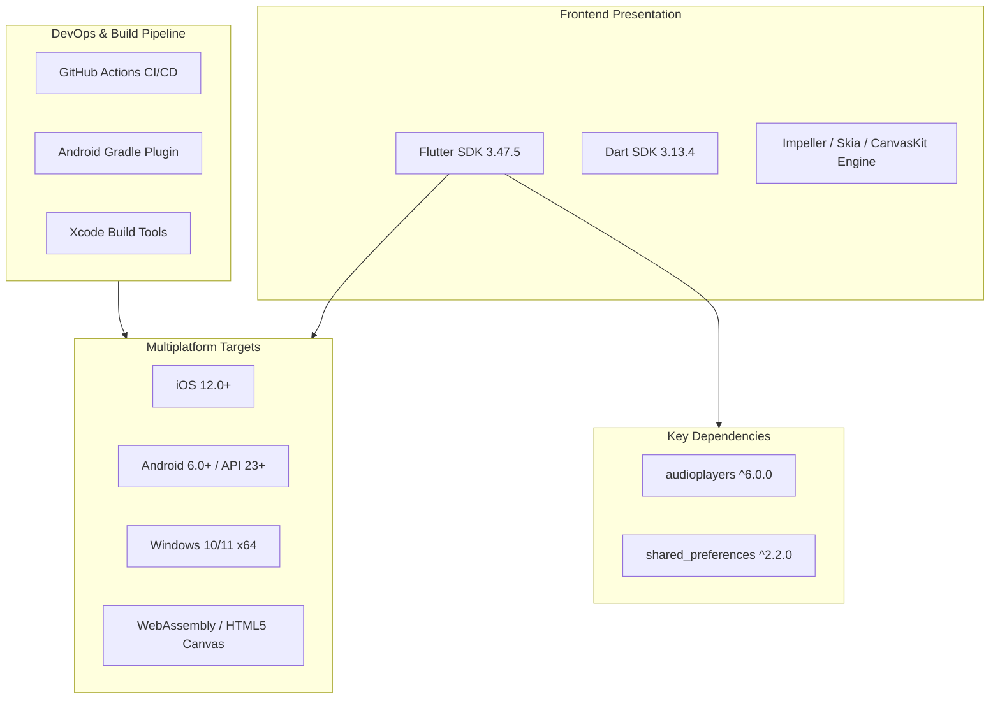
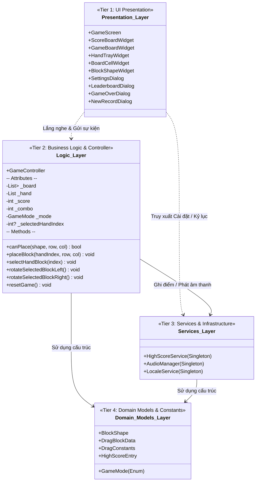
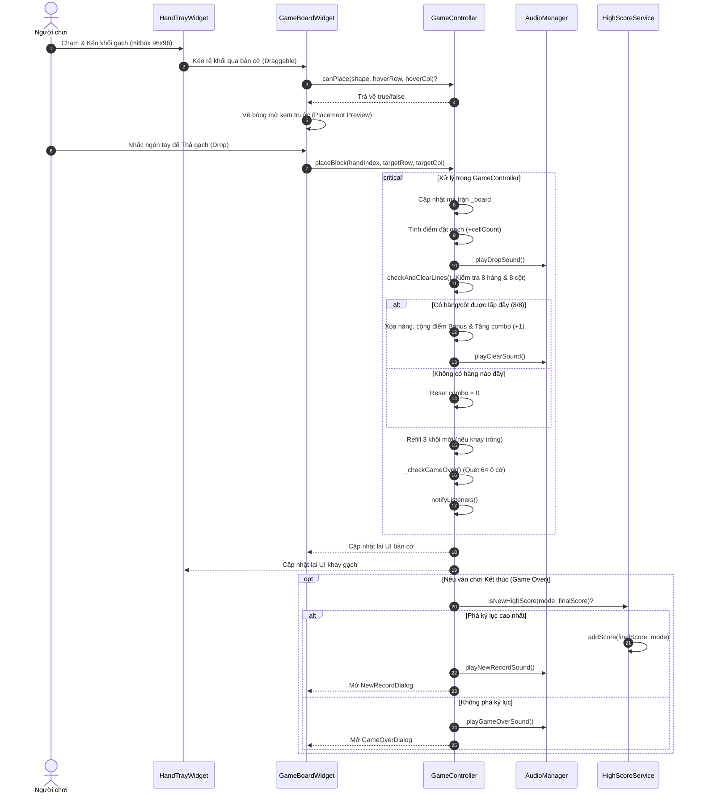
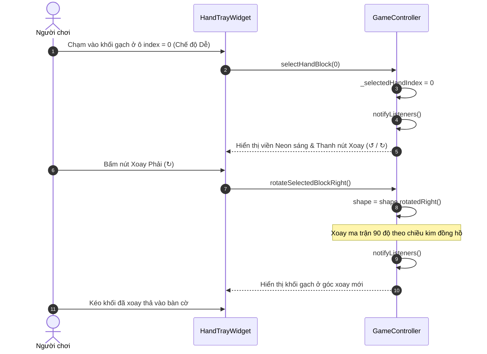
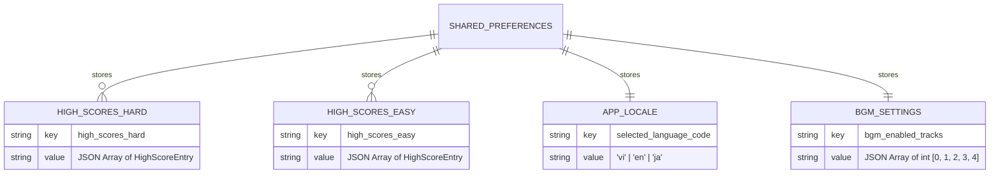
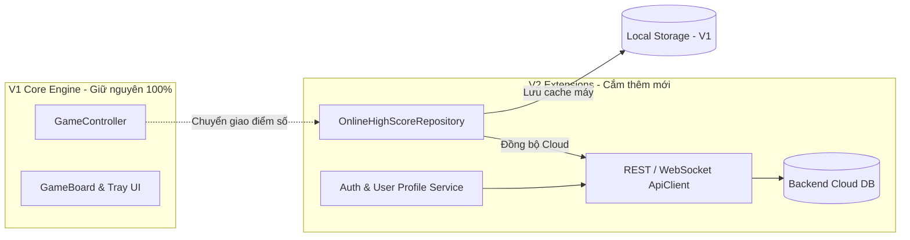

# TÀI LIỆU THIẾT KẾ KIẾN TRÚC TỔNG THỂ (HLD)
## DỰ ÁN: BLOCK PUZZLE GAME (PHIÊN BẢN 1.0 - OFFLINE STANDALONE)

---

| Thông tin tài liệu | Chi tiết |
| :--- | :--- |
| **Tên sản phẩm** | Block Puzzle Game |
| **Mã tài liệu** | HLD-V1.0 (High-Level Architecture Design) |
| **Phiên bản hệ thống** | Version 1.0.0 (Offline Standalone) |
| **Mô hình kiến trúc** | 4-Tier Layered Architecture (Phân lớp 4 tầng) |
| **Framework & Ngôn ngữ** | Flutter SDK & Dart Language |
| **Chuẩn tham chiếu** | IEEE 1016-2009 (Standard for Information Technology — Systems Design — Software Design Descriptions) |
| **Trạng thái tài liệu** | Chính thức (Approved / Baseline) |

---

## MỤC LỤC
1. [MỤC TIÊU & NGUYÊN TẮC THIẾT KẾ KIẾN TRÚC](#1-mục-tiêu--nguyên-tắc-thiết-kế-kiến-trúc)
2. [NGĂN XẾP CÔNG NGHỆ & MÔI TRƯỜNG PHÁT TRIỂN (TECHNOLOGY STACK)](#2-ngăn-xếp-công-nghệ--môi-trường-phát-triển-technology-stack)
3. [KIẾN TRÚC TỔNG THỂ PHÂN LỚP (4-TIER LAYERED ARCHITECTURE)](#3-kiến-trúc-tổng-thể-phân-lớp-4-tier-layered-architecture)
4. [QUẢN LÝ TRẠNG THÁI & LUỒNG DỮ LIỆU (STATE MANAGEMENT & DATA FLOWS)](#4-quản-lý-trạng-thái--luồng-dữ-liệu-state-management--data-flows)
5. [THIẾT KẾ LƯU TRỮ DỮ LIỆU CỤC BỘ (LOCAL DATA PERSISTENCE & SCHEMA DESIGN)](#5-thiết-kế-lưu-trữ-dữ-liệu-cục-bộ-local-data-persistence--schema-design)
6. [TÍCH HỢP PHẦN CỨNG & TƯƠNG THÍCH ĐA NỀN TẢNG (CROSS-PLATFORM INTEGRATION)](#6-tích-hợp-phần-cứng--tương-thích-đa-nền-tảng-cross-platform-integration)
7. [ĐIỂM NỐI MỞ RỘNG CHO PHIÊN BẢN 2.0 (EXTENSION POINTS FOR V2.0 ONLINE)](#7-điểm-nối-mở-rộng-cho-phiên-bản-20-extension-points-for-v20-online)

---

## 1. MỤC TIÊU & NGUYÊN TẮC THIẾT KẾ KIẾN TRÚC

### 1.1. Mục tiêu kiến trúc (Architectural Goals)
* **Hiệu năng cao & Độ trễ thấp (High Performance & Low Latency):** Đạt tốc độ dựng hình ổn định **60 FPS** (hoặc 120 FPS trên màn hình tần số quét cao), các thao tác kéo thả và xử lý ma trận không phát sinh hiện tượng drop frame.
* **Tách biệt Trách nhiệm (Separation of Concerns - SoC):** Tách bạch hoàn toàn giữa tầng hiển thị giao diện (UI Presentation), tầng điều phối luật chơi (Game Logic Controller), tầng dịch vụ tiện ích (Services) và tầng dữ liệu (Domain Models).
* **Độ tin cậy & Tự trị (Zero Dependency on Network):** Ở phiên bản V1.0, toàn bộ hệ thống hoạt động tự trị 100% ngoại tuyến, xử lý lưu trữ an toàn, không bị crash khi mất mạng hoặc đóng app đột ngột.
* **Tính mở rộng (Open for Extension to V2.0):** Cấu trúc mã nguồn sẵn sàng để cắm thêm tầng mạng (Network Layer / API Client) khi nâng cấp lên V2.0 mà không phải đập bỏ hoặc viết lại logic bàn cờ cốt lõi.

### 1.2. Nguyên tắc thiết kế (Design Principles)
1. **Single Source of Truth:** Trạng thái ván chơi (bàn cờ, khay gạch, điểm số, trạng thái game over) chỉ được lưu trữ và cập nhật duy nhất tại `GameController`.
2. **Reactive UI with Pure Flutter:** Sử dụng cơ chế `ChangeNotifier` và `ListenableBuilder` tích hợp sẵn của Flutter SDK, loại bỏ việc phụ thuộc vào các thư viện quản lý state bên thứ ba cồng kềnh (như Redux, Bloc) để giữ ứng dụng nhẹ và khởi động siêu nhanh.
3. **Singleton Services:** Các dịch vụ dùng chung xuyên suốt vòng đời ứng dụng (`AudioManager`, `HighScoreService`, `LocaleService`) được triển khai theo mẫu thiết kế **Singleton** để dễ dàng truy cập và chia sẻ tài nguyên.

---

## 2. NGĂN XẾP CÔNG NGHỆ & MÔI TRƯỜNG PHÁT TRIỂN (TECHNOLOGY STACK)

### 2.1. Danh mục Ngăn xếp Công nghệ (Tech Stack)



| Thành phần | Công nghệ / Thư viện | Phiên bản | Vai trò & Lý do lựa chọn |
| :--- | :--- | :--- | :--- |
| **Core Framework** | **Flutter SDK** | `3.47.5 (Stable)` | Framework đa nền tảng tối ưu nhất hiện nay, cho phép biên dịch mã nguồn native trực tiếp ra mã máy (ARM64, x64, WASM) với hiệu năng đồ họa vượt trội. |
| **Programming Language** | **Dart** | `3.13.4` | Ngôn ngữ tĩnh kiểu mạnh (Sound Null Safety), tối ưu hóa việc quản lý bộ nhớ (Generational Garbage Collector) và hỗ trợ cả AOT (Ahead-Of-Time) lẫn JIT. |
| **Graphics Engine** | **Impeller / Skia / CanvasKit** | Mặc định theo Flutter | Đảm bảo tốc độ dựng hình mượt mà 60–120 FPS, xử lý shader, gradient và hiệu ứng phát sáng mượt mà. |
| **Audio Engine** | **audioplayers** | `^6.0.0` | Thư viện phát âm thanh đa luồng chuẩn cho Flutter, hỗ trợ phát đồng thời BGM (Loop/Shuffle) và các hiệu ứng SFX với độ trễ thấp trên iOS, Android, Windows, Web. |
| **Local Storage** | **shared_preferences** | `^2.2.0` | Thư viện bọc API lưu trữ gốc (NSUserDefaults trên iOS/macOS, SharedPreferences trên Android, SQLite/Registry trên Windows), đọc/ghi Key-Value tức thời. |
| **Code Quality / Linter** | **flutter_lints** | `^3.0.0` | Bộ quy chuẩn phân tích tĩnh (Static Analysis) nghiêm ngặt, đảm bảo mã nguồn sạch và tuân thủ Effective Dart. |

---

## 3. KIẾN TRÚC TỔNG THỂ PHÂN LỚP (4-TIER LAYERED ARCHITECTURE)

Hệ thống được tổ chức thành 4 tầng độc lập theo chiều dọc:



### 3.1. Tầng 1: Tầng Giao diện (Presentation Layer)
Chịu trách nhiệm render các phần tử UI, bắt sự kiện cảm ứng (Tap, Drag, Drop) và hiển thị hoạt ảnh (Animations):
* **`GameScreen`:** Màn hình gốc bao bọc toàn bộ giao diện, quản lý vòng đời khởi tạo (`initState`, `dispose`) của `GameController`.
* **`ScoreBoardWidget`:** Hiển thị điểm số hiện tại kèm hiệu ứng nhảy số (`AnimatedSwitcher`), Mascot Miki, Cúp Kỷ lục, Nút gạt chế độ Khó/Dễ và cụm nút thao tác (Cài đặt, Âm thanh, Chơi lại).
* **`GameBoardWidget` & `BoardCellWidget`:** Hiển thị bàn cờ $8 \times 8$, xử lý `DragTarget` nhận gạch thả vào, tính toán tọa độ Snap và vẽ bóng mờ xem trước (Preview).
* **`HandTrayWidget` & `BlockShapeWidget`:** Hiển thị 3 khối gạch ứng viên, xử lý hitbox cảm ứng $96 \times 96\text{ px}$ (`HitTestBehavior.opaque`), xử lý `Draggable` và hiển thị thanh công cụ xoay gạch ở chế độ Dễ.
* **Các Hộp thoại Modal:** `SettingsDialog` (Đa ngôn ngữ & BGM Playlist), `LeaderboardDialog` (Top 10 Khó/Dễ), `GameOverDialog` & `NewRecordDialog`.

### 3.2. Tầng 2: Tầng Điều khiển Nghiệp vụ (Game Logic Controller Layer)
* **`GameController` (Kế thừa `ChangeNotifier`):**
  * Lưu trữ toàn bộ State của ván chơi: Ma trận bàn cờ $8 \times 8$ (`List<List<Color?>>`), danh sách 3 khối trong khay (`List<BlockShape?>`), điểm số (`score`), chỉ số combo (`combo`), chế độ chơi (`mode`).
  * Thực thi các thuật toán nghiệp vụ:
    * `canPlace(shape, row, col)`: Kiểm tra tính hợp lệ của nước đi.
    * `placeBlock(handIndex, row, col)`: Đặt gạch, xóa hàng, tính điểm, cập nhật kỷ lục, kiểm tra Game Over và phát tín hiệu `notifyListeners()`.
    * `rotateSelectedBlockLeft()` / `rotateSelectedBlockRight()`: Xoay ma trận khối $90^\circ$ ở chế độ Dễ.
    * `canPlaceAnywhere(shape)`: Quét toàn bộ 64 ô cờ để xác định điều kiện Game Over.

### 3.3. Tầng 3: Tầng Dịch vụ Tiện ích & Hạ tầng (Services Layer)
* **`HighScoreService` (Singleton):**
  * Quản lý dữ liệu kỷ lục cục bộ: Phân tách 2 danh sách Top 10 cho chế độ Khó (`high_scores_hard`) và Dễ (`high_scores_easy`).
  * Cung cấp các hàm kiểm tra kỷ lục mới (`isNewHighScore`), thêm điểm mới (`addScore`) và tự động ghi vào `SharedPreferences`.
* **`AudioManager` (Singleton):**
  * Quản lý 2 luồng âm thanh độc lập: BGM Player (phát nhạc nền lặp/ngẫu nhiên) và SFX Player (hiệu ứng đặt gạch, xóa hàng, thua, thắng).
  * Điều phối bộ đếm thời gian khoảng lặng **5 giây** (`Timer`) giữa các bài BGM.
  * Lọc danh sách bài hát theo cấu hình người dùng bật/tắt trong `SettingsDialog`.
* **`LocaleService` (Singleton):**
  * Quản lý ngôn ngữ ứng dụng: Cung cấp từ điển chuỗi phản ứng cho 3 ngôn ngữ (`vi`, `en`, `ja`) qua phương thức `tr(key)`.

### 3.4. Tầng 4: Tầng Mô hình Dữ liệu (Domain Models Layer)
* **`BlockShape`:** Biểu diễn hình học của khối gạch gồm kích thước ma trận (`rows`, `cols`), ma trận nhị phân (`matrix: List<List<int>>`), màu sắc (`color`), màu phát sáng (`glowColor`). Cung cấp phương thức `rotatedLeft()` và `rotatedRight()`.
* **`DragBlockData`:** Dữ liệu đóng gói gửi qua luồng kéo thả của Flutter `Draggable`, bao gồm chỉ số ô khay (`handIndex`) và đối tượng `BlockShape`.
* **`DragConstants`:** Tập hợp các hằng số công thái học chuẩn: `touchLift = 50.0`, `cellSize = 34.0`, `cellSpacing = 4.0`, `centerDistanceFactor = 0.50`.
* **`HighScoreEntry`:** Thực thể bản ghi kỷ lục gồm `id`, `score`, `timestamp`, `mode`. Hỗ trợ chuyển đổi qua lại JSON (`toJson`, `fromJson`).
* **`GameMode` (Enum):** Định nghĩa 2 chế độ: `GameMode.hard` và `GameMode.easy`.

---

## 4. QUẢN LÝ TRẠNG THÁI & LUỒNG DỮ LIỆU (STATE MANAGEMENT & DATA FLOWS)

### 4.1. Cơ chế Quản lý Trạng thái (Reactive State Management)
Ứng dụng sử dụng mô hình **Reactive Publisher-Subscriber** thuần túy của Flutter:
* `GameController`, `HighScoreService`, `AudioManager`, `LocaleService` đều kế thừa hoặc triển khai `ChangeNotifier` / `Listenable`.
* Các Widget giao diện sử dụng `ListenableBuilder` để đăng ký lắng nghe sự kiện thay đổi. Khi có cập nhật trạng thái (ví dụ: người chơi đặt gạch thành công, đổi ngôn ngữ, bật tắt nhạc), chỉ những Widget phụ thuộc mới được dựng lại (re-render), giúp tối ưu hóa CPU và GPU.

---

### 4.2. Sơ đồ tuần tự: Thao tác Kéo - Thả gạch & Xóa hàng (Drag-Drop & Line Clear Flow)



---

### 4.3. Sơ đồ tuần tự: Chọn & Xoay gạch ở Chế độ Dễ (Rotation Flow)



---

## 5. THIẾT KẾ LƯU TRỮ DỮ LIỆU CỤC BỘ (LOCAL DATA PERSISTENCE & SCHEMA DESIGN)

### 5.1. Cơ chế Lưu trữ Key-Value (SharedPreferences Store)
Toàn bộ dữ liệu của ứng dụng được lưu trữ cục bộ dưới dạng cặp khóa - giá trị (**Key-Value**) thông qua `SharedPreferences`.



### 5.2. Đặc tả Chi tiết Cấu trúc Dữ liệu (JSON Schemas)

#### a. Khóa Kỷ lục Chế độ Khó & Dễ (`high_scores_hard` & `high_scores_easy`)
Lưu trữ một danh sách (JSON Array) gồm tối đa 10 đối tượng kỷ lục, được tự động sắp xếp giảm dần theo điểm số:

```json
[
  {
    "id": "1727084400000_hard",
    "score": 4520,
    "timestamp": "2026-09-23T18:30:00.000Z",
    "mode": "hard"
  },
  {
    "id": "1727083200000_hard",
    "score": 3210,
    "timestamp": "2026-09-23T18:10:00.000Z",
    "mode": "hard"
  }
]
```

* **Quy tắc ghi dữ liệu:**
  1. Khi kết thúc ván, điểm mới được so khớp với danh sách hiện tại.
  2. Thêm điểm mới vào danh sách, sắp xếp giảm dần theo trường `score`.
  3. Chỉ giữ lại đúng **Top 10 phần tử đầu tiên** (Cắt bỏ các phần tử thứ 11 trở đi).
  4. Tuần tự hóa thành chuỗi JSON và gọi `prefs.setString(key, jsonString)`.

#### b. Khóa Cấu hình Ngôn ngữ (`selected_language_code`)
Lưu trữ chuỗi String mã định danh ngôn ngữ:
* Giá trị hợp lệ: `"vi"` (Tiếng Việt - Mặc định), `"en"` (Tiếng Anh), `"ja"` (Tiếng Nhật).

#### c. Khóa Cấu hình Danh sách Nhạc nền BGM (`bgm_enabled_tracks`)
Lưu trữ danh sách mảng số nguyên (JSON Array of Integers) đại diện cho chỉ số (0..4) của 5 bài BGM được bật:
```json
[0, 1, 2, 3, 4]
```

---

## 6. TÍCH HỢP PHẦN CỨNG & TƯƠNG THÍCH ĐA NỀN TẢNG (CROSS-PLATFORM INTEGRATION)

### 6.1. Xử lý Âm thanh Đa nền tảng (Hardware Audio Context)
* **Trên Android:** Hệ thống cấu hình `AudioContextAndroid` với chế độ `audioFocus: AudioFocus.gainTransientMayDuck`, đảm bảo khi phát các hiệu ứng âm thanh SFX ngắn (`drop.wav`, `clear.wav`), nhạc nền BGM **không bị ngắt hoặc tắt tiếng đột ngột**.
* **Trên iOS:** Cấu hình `AudioCategory.ambient` cho phép phát âm thanh hòa quyện với hệ điều hành, tôn trọng chế độ im lặng (Silent Switch).
* **Trên Windows & Web:** Sử dụng API phát âm thanh tiêu chuẩn không chặn (Non-blocking), tương thích với chính sách tương tác người dùng (User Interaction Gesture) của trình duyệt.

### 6.2. Thích ứng Giao diện Màn hình (Responsive UI & Ergonomics)
* **Màn hình hẹp (iPhone SE, iPhone 16):**
  * Thanh tiêu đề sử dụng `Flexible` và `mainAxisSize: MainAxisSize.min` để tự động thu gọn các khoảng đệm, đảm bảo nút Cúp Kỷ lục, Chuyển chế độ Khó/Dễ, Cài đặt, Bật/tắt nhạc và Chơi lại luôn hiển thị đầy đủ, không bị đẩy tràn khỏi màn hình.
* **Màn hình lớn / Tablet / Desktop:**
  * Bàn cờ giới hạn kích thước tối đa $420 \times 420\text{ px}$ bằng `LayoutBuilder` và luôn được căn giữa màn hình (`Center`), giữ tỷ lệ bàn cờ cân đối, thẩm mỹ.

---

## 7. ĐIỂM NỐI MỞ RỘNG CHO PHIÊN BẢN 2.0 (EXTENSION POINTS FOR V2.0 ONLINE)

Kiến trúc phân lớp của Version 1.0 được thiết kế sẵn các điểm móc nối (Hooks) để nâng cấp lên Phiên bản 2.0 (Online Multiplayer / Cloud Sync) một cách dễ dàng:



1. **Chuyển đổi `HighScoreService` $\rightarrow$ `OnlineHighScoreRepository`:**
   * Ở V2.0, `GameController` chỉ cần gọi đến interface Repository. Repository sẽ triển khai mô hình **Offline-First**: lưu điểm vào `SharedPreferences` (logic V1) trước để phản hồi tức thì, sau đó gửi request ngầm lên Cloud Server để xếp hạng toàn cầu.
2. **Cắm thêm `AuthService`:**
   * Thêm module đăng nhập (Guest ID, Google, Apple ID) tại tầng Services mà không làm ảnh hưởng đến mã nguồn của bàn cờ hay logic đặt gạch.
3. **Chống Gian lận (Anti-Cheat Payload Hook):**
   * `GameController` đã có sẵn cơ chế theo dõi từng lượt đặt gạch. Ở V2, controller có thể dễ dàng xuất ra mảng lịch sử nước đi (`MoveHistory`) để gửi kèm điểm số lên Server xác thực.

---
*Tài liệu Thiết kế Kiến trúc Tổng thể Phiên bản 1.0 kết thúc tại đây.*
