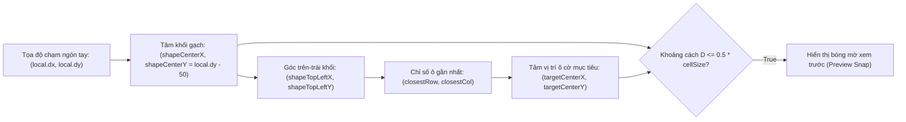

# TÀI LIỆU THIẾT KẾ CHI TIẾT (DDD / LOW-LEVEL DESIGN)
## DỰ ÁN: BLOCK PUZZLE GAME (PHIÊN BẢN 1.0 - OFFLINE STANDALONE)

---

| Thông tin tài liệu | Chi tiết |
| :--- | :--- |
| **Tên sản phẩm** | Block Puzzle Game |
| **Mã tài liệu** | DDD-V1.0 (Detailed Software Design Specification) |
| **Phiên bản hệ thống** | Version 1.0.0 (Offline Standalone) |
| **Mức độ chi tiết** | Low-Level Design (Chi tiết từng Class, Thuật toán, Toán học, Hàm & Biến) |
| **Chuẩn tham chiếu** | IEEE 1016-2009 Standard for Detailed Software Design |
| **Trạng thái tài liệu** | Chính thức (Approved / Baseline) |

---

## MỤC LỤC
1. [TỔNG QUAN & PHẠM VI THIẾT KẾ CHI TIẾT](#1-tổng-quan--phạm-vi-thiết-kế-chi-tiết)
2. [CHI TIẾT TẦNG MÔ HÌNH DỮ LIỆU & HẰNG SỐ (MODELS & CONSTANTS)](#2-chi-tiết-tầng-mô-hình-dữ-liệu--hằng-số-models--constants)
3. [CHI TIẾT TẦNG ĐIỀU KHIỂN NGHIỆP VỤ & THUẬT TOÁN (GAME CONTROLLER & ALGORITHMS)](#3-chi-tiết-tầng-điều-khiển-nghiệp-vụ--thuật-toán-game-controller--algorithms)
4. [CHI TIẾT TOÁN HỌC CÔNG THÁI HỌC & KÉO THẢ (DRAG-DROP & ERGONOMICS MATH)](#4-chi-tiết-toán-học-công-thái-học--kéo-thả-drag-drop--ergonomics-math)
5. [CHI TIẾT TẦNG GIAO DIỆN NGƯỜI DÙNG (PRESENTATION WIDGETS SPECIFICATION)](#5-chi-tiết-tầng-giao-diện-người-dùng-presentation-widgets-specification)
6. [CHI TIẾT TẦNG DỊCH VỤ HẠ TẦNG (SERVICES SPECIFICATION)](#6-chi-tiết-tầng-dịch-vụ-hạ-tầng-services-specification)
7. [ĐẶC TẢ KIỂM THỬ ĐƠN VỊ & CHẤT LƯỢNG (UNIT TEST SPECIFICATIONS)](#7-đặc-tả-kiểm-thử-đơn-vị--chất-lượng-unit-test-specifications)

---

## 1. TỔNG QUAN & PHẠM VI THIẾT KẾ CHI TIẾT

Tài liệu này cung cấp bản đặc tả kỹ thuật chi tiết ở cấp độ mã nguồn (Source Code Level) cho tất cả các Class, phương thức, biến số, giải thuật toán học, cấu trúc dữ liệu và sự kiện giao diện trong dự án **Block Puzzle V1.0**.

Tất cả các thành phần được định vị trong thư mục mã nguồn `client/lib/`:
```text
client/lib/
├── logic/
│   └── game_controller.dart          # Trái tim điều khiển nghiệp vụ trò chơi
├── models/
│   ├── block_shape.dart              # Ma trận hình học & màu sắc khối gạch
│   ├── drag_data.dart                # Dữ liệu kéo thả & hằng số công thái học
│   └── high_score_entry.dart         # Cấu trúc bản ghi kỷ lục
├── services/
│   ├── audio_manager.dart            # Quản lý phát BGM, SFX & Playlist
│   ├── high_score_service.dart       # Quản lý & lưu trữ kỷ lục SharedPreferences
│   └── locale_service.dart           # Quản lý đa ngôn ngữ 3 thứ tiếng (Vi, En, Ja)
├── ui/
│   ├── screens/
│   │   └── game_screen.dart          # Màn hình Scaffold chính
│   └── widgets/
│       ├── block_widget.dart         # Widget vẽ khối gạch từ ma trận nhị phân
│       ├── board_cell.dart           # Widget ô cờ đơn vị (Trống, Có màu, Preview)
│       ├── game_board.dart           # Bàn cờ 8x8 & bộ xử lý DragTarget
│       ├── game_over_dialog.dart     # Hộp thoại Kết thúc ván
│       ├── hand_tray.dart            # Khay 3 khối gạch & bộ nút xoay
│       ├── leaderboard_dialog.dart   # Hộp thoại Top 10 2 Tab Khó/Dễ
│       ├── new_record_dialog.dart    # Hộp thoại Chúc mừng Phá kỷ lục
│       ├── score_board.dart          # Bảng điểm, Mascot Miki & Thanh công cụ
│       └── settings_dialog.dart      # Hộp thoại Cài đặt Ngôn ngữ & Nhạc
└── main.dart                         # Điểm khởi động ứng dụng Flutter
```

---

## 2. CHI TIẾT TẦNG MÔ HÌNH DỮ LIỆU & HẰNG SỐ (MODELS & CONSTANTS)

### 2.1. `BlockShape` (`client/lib/models/block_shape.dart`)
Biểu diễn một khối gạch dưới dạng ma trận nhị phân 2 chiều và thông số màu sắc.

#### a. Thuộc tính (Properties)
* `final List<List<int>> matrix`: Ma trận nhị phân kích thước $R \times C$ đại diện cho hình dáng khối ($1$ là có ô gạch, $0$ là ô rỗng).
* `final Color color`: Màu sắc chủ đạo của khối gạch.
* `final Color glowColor`: Màu viền đổ bóng phát sáng (Neon Glow).
* `int get rows => matrix.length`: Số hàng của ma trận.
* `int get cols => matrix[0].length`: Số cột của ma trận.
* `int get cellCount`: Tổng số ô vuông đơn vị có giá trị $1$ trong khối.

#### b. Thuật toán Xoay Ma trận 90 độ (Matrix Rotation Algorithms)

##### 1. Xoay Thuận chiều Kim Đồng hồ $90^\circ$ (`rotatedRight()`)
* **Công thức toán học:** Ma trận mới $M'$ kích thước $C \times R$, trong đó:
  $$M'[c][R - 1 - r] = M[r][c]$$
* **Mã Dart:**
  ```dart
  BlockShape rotatedRight() {
    final newRows = cols;
    final newCols = rows;
    final newMatrix = List.generate(
      newRows,
      (r) => List.generate(newCols, (c) => matrix[rows - 1 - c][r]),
    );
    return BlockShape(matrix: newMatrix, color: color, glowColor: glowColor);
  }
  ```

##### 2. Xoay Ngược chiều Kim Đồng hồ $90^\circ$ (`rotatedLeft()`)
* **Công thức toán học:** Ma trận mới $M'$ kích thước $C \times R$, trong đó:
  $$M'[C - 1 - c][r] = M[r][c]$$
* **Mã Dart:**
  ```dart
  BlockShape rotatedLeft() {
    final newRows = cols;
    final newCols = rows;
    final newMatrix = List.generate(
      newRows,
      (r) => List.generate(newCols, (c) => matrix[c][newCols - 1 - r]),
    );
    return BlockShape(matrix: newMatrix, color: color, glowColor: glowColor);
  }
  ```

#### c. Danh mục Hình học Tiêu chuẩn (`BlockShape.allShapes`)
Danh mục gồm 19 hình khối đa dạng:
* **Khối đơn & Thanh thẳng:** $1 \times 1$ (Dot), $1 \times 2, 1 \times 3, 1 \times 4, 1 \times 5$, $2 \times 1, 3 \times 1, 4 \times 1, 5 \times 1$.
* **Khối Vuông & Chữ nhật:** $2 \times 2$ (Square), $3 \times 3$ (Big Square), $2 \times 3, 3 \times 2$.
* **Khối Góc & Chữ L:** Khối chữ L góc $2 \times 2$ (4 góc quay), Khối chữ L lớn $3 \times 3$ (4 góc quay).
* **Khối Chữ T & Chữ Z:** Hình chữ T 4 hướng, Hình bậc thang chữ Z/S.

---

### 2.2. `DragBlockData` & `DragConstants` (`client/lib/models/drag_data.dart`)

#### a. Hằng số Công thái học (`DragConstants`)
```dart
class DragConstants {
  static const double touchLift = 50.0;           // Nâng khối cao hơn ngón tay 50px
  static const double cellSize = 34.0;            // Kích thước ô cờ chuẩn khi kéo (px)
  static const double cellSpacing = 4.0;          // Khoảng cách giữa các ô (px)
  static const double totalCellStep = cellSize + cellSpacing; // = 38.0px
  static const double centerDistanceFactor = 0.50;// Dung sai bắt điểm = 50% cellSize
}
```

#### b. Lớp Dữ liệu Kéo (`DragBlockData`)
* `final int handIndex`: Vị trí của khối trong khay chờ ($0, 1, 2$).
* `final BlockShape shape`: Đối tượng khối gạch đang được kéo.
* `double get totalWidth => shape.cols * DragConstants.totalCellStep - DragConstants.cellSpacing`: Chiều rộng thực tế khi hiển thị lúc kéo.
* `double get totalHeight => shape.rows * DragConstants.totalCellStep - DragConstants.cellSpacing`: Chiều cao thực tế khi hiển thị lúc kéo.

---

### 2.3. `HighScoreEntry` & `GameMode` (`client/lib/models/high_score_entry.dart`)
* `enum GameMode { hard, easy }`
* `class HighScoreEntry`:
  * `final String id`: Khóa định danh duy nhất (Timestamp string).
  * `final int score`: Điểm số đạt được.
  * `final DateTime timestamp`: Ngày giờ hoàn thành ván chơi.
  * `final GameMode mode`: Chế độ chơi tương ứng.
  * `Map<String, dynamic> toJson()`: Tuần tự hóa đối tượng thành Map JSON.
  * `factory HighScoreEntry.fromJson(Map<String, dynamic> json)`: Khởi tạo đối tượng từ dữ liệu JSON.

---

## 3. CHI TIẾT TẦNG ĐIỀU KHIỂN NGHIỆP VỤ & THUẬT TOÁN (GAME CONTROLLER & ALGORITHMS)

Lớp `GameController` kế thừa `ChangeNotifier` quản lý toàn bộ logic ván đấu.

### 3.1. Cấu trúc Thuộc tính Nội tại (Internal State)
```dart
class GameController extends ChangeNotifier {
  static const int boardSize = 8;                         // Kích thước ma trận 8x8
  late List<List<Color?>> _board;                         // Ma trận bàn cờ 8x8
  late List<BlockShape?> _hand;                           // 3 ô gạch khay chờ
  int _score = 0;                                         // Điểm số hiện tại
  int _combo = 0;                                         // Chỉ số chuỗi combo
  GameMode _mode = GameMode.hard;                         // Chế độ chơi hiện tại
  int? _selectedHandIndex;                                // Khối đang chọn ở chế độ Dễ
  bool _isGameOver = false;                               // Trạng thái kết thúc ván
  ...
}
```

---

### 3.2. Chi tiết Thuật toán Cốt lõi (Core Algorithms)

#### a. Thuật toán Kiểm tra Khả năng Đặt Gạch (`canPlace`)
Kiểm tra xem khối gạch `shape` có thể đặt vừa vào vị trí góc trên-trái `(targetRow, targetCol)` trên bàn cờ hay không.

* **Độ phức tạp thời gian:** $\mathcal{O}(R_{\text{shape}} \times C_{\text{shape}}) \le \mathcal{O}(5 \times 5) = \text{Tối đa 25 phép so sánh (Cực nhanh)}$.
* **Mã giải thuật:**
  ```dart
  bool canPlace(BlockShape shape, int targetRow, int targetCol) {
    // 1. Kiểm tra tràn biên bàn cờ
    if (targetRow < 0 || targetCol < 0) return false;
    if (targetRow + shape.rows > boardSize) return false;
    if (targetCol + shape.cols > boardSize) return false;

    // 2. Kiểm tra va chạm với các ô đã có gạch
    for (int r = 0; r < shape.rows; r++) {
      for (int c = 0; c < shape.cols; c++) {
        if (shape.matrix[r][c] == 1) {
          if (_board[targetRow + r][targetCol + c] != null) {
            return false; // Trùng ô đã bị chiếm dụng
          }
        }
      }
    }
    return true;
  }
  ```

---

#### b. Thuật toán Quét & Xóa Hàng Đồng thời (`_checkAndClearLines`)
Sau khi đặt gạch, hệ thống đồng thời quét toàn bộ 8 hàng ngang và 8 cột dọc.

* **Độ phức tạp thời gian:** $\mathcal{O}(\text{boardSize}^2) = \mathcal{O}(8 \times 8) = 64\text{ phép lặp}$.
* **Quy tắc tính điểm thưởng:**
  * Điểm cơ bản: $10 \text{ điểm} \times \text{Tổng số đường xóa}$.
  * Thưởng Multi-line (khi $\ge 2$ đường): $(\text{Tổng số đường} - 1) \times 15\text{ điểm}$.
  * Thưởng Combo: $\text{Combo} \times 10\text{ điểm}$.
* **Mã giải thuật:**
  ```dart
  int _checkAndClearLines() {
    final rowsToClear = <int>[];
    final colsToClear = <int>[];

    // Quét 8 hàng ngang
    for (int r = 0; r < boardSize; r++) {
      if (_board[r].every((cell) => cell != null)) {
        rowsToClear.add(r);
      }
    }

    // Quét 8 cột dọc
    for (int c = 0; c < boardSize; c++) {
      bool isColFull = true;
      for (int r = 0; r < boardSize; r++) {
        if (_board[r][c] == null) {
          isColFull = false;
          break;
        }
      }
      if (isColFull) colsToClear.add(c);
    }

    final totalLines = rowsToClear.length + colsToClear.length;
    if (totalLines == 0) {
      _combo = 0;
      return 0;
    }

    // Tăng combo và phát âm thanh
    _combo++;
    AudioManager.instance.playClearSound();

    // Xóa các ô thuộc hàng đầy
    for (final r in rowsToClear) {
      for (int c = 0; c < boardSize; c++) {
        _board[r][c] = null;
      }
    }

    // Xóa các ô thuộc cột đầy
    for (final c in colsToClear) {
      for (int r = 0; r < boardSize; r++) {
        _board[r][c] = null;
      }
    }

    // Tính tổng điểm thưởng
    final linePoints = totalLines * 10;
    final multiLineBonus = (totalLines > 1) ? (totalLines - 1) * 15 : 0;
    final comboBonus = _combo * 10;

    return linePoints + multiLineBonus + comboBonus;
  }
  ```

---

#### c. Thuật toán Quét Kiểm tra Game Over (`_checkGameOver`)
Kiểm tra xem toàn bộ các khối còn lại trong khay có thể đặt được vào bất kỳ vị trí nào trên bàn cờ hay không.

* **Độ phức tạp thời gian:** $\mathcal{O}(3 \times 8 \times 8 \times 25) \approx 4800\text{ thao tác tối đa (Thực thi < 0.2ms)}$.
* **Mã giải thuật:**
  ```dart
  bool canPlaceAnywhere(BlockShape shape) {
    for (int r = 0; r <= boardSize - shape.rows; r++) {
      for (int c = 0; c <= boardSize - shape.cols; c++) {
        if (canPlace(shape, r, c)) {
          return true; // Còn ít nhất 1 vị trí hợp lệ
        }
      }
    }
    return false;
  }

  void _checkGameOver() {
    for (final shape in _hand) {
      if (shape != null && canPlaceAnywhere(shape)) {
        _isGameOver = false;
        return; // Chưa thua
      }
    }
    _isGameOver = true; // Thua cuộc
    _handleGameOverEvent();
  }
  ```

---

## 4. CHI TIẾT TOÁN HỌC CÔNG THÁI HỌC & KÉO THẢ (DRAG-DROP & ERGONOMICS MATH)

### 4.1. Vùng Nhận Chạm Khay Gạch (Hand Tray Hitbox)
* **Kích thước khung ô:** $W_{\text{slot}} = 96\text{ px}, H_{\text{slot}} = 96\text{ px}$.
* **Cấu hình Touch:** Bọc toàn bộ widget trong `GestureDetector(behavior: HitTestBehavior.opaque)` và `Draggable(hitTestBehavior: HitTestBehavior.opaque)`.
* **Cấu hình Child:** Sử dụng `SizedBox.expand` để kéo giãn diện tích nhận chạm ra toàn bộ $96 \times 96\text{ px}$, khắc phục việc khối $1 \times 1$ hay thanh mảnh $1 \times 5$ bị trượt cảm ứng.

---

### 4.2. Công thức Căn Tâm & Bắt Điểm Snap trên Bàn Cờ (`GameBoardWidget._updateHover`)



#### Các bước tính toán hình học:
1. **Tọa độ tâm khối gạch khi kéo:**
   $$X_{\text{center}} = \text{local.dx}$$
   $$Y_{\text{center}} = \text{local.dy} - \text{touchLift} \quad (\text{với } \text{touchLift} = 50.0\text{ px})$$
2. **Kích thước vật lý của khối khi kéo:**
   $$W_{\text{shape}} = \text{cols} \times (\text{cellSize} + \text{cellSpacing}) - \text{cellSpacing}$$
   $$H_{\text{shape}} = \text{rows} \times (\text{cellSize} + \text{cellSpacing}) - \text{cellSpacing}$$
3. **Tọa độ góc trên-trái của khối:**
   $$X_{\text{top-left}} = X_{\text{center}} - \frac{W_{\text{shape}}}{2}, \quad Y_{\text{top-left}} = Y_{\text{center}} - \frac{H_{\text{shape}}}{2}$$
4. **Tính chỉ số ô gần nhất trên lưới cờ ($8 \times 8$):**
   $$\text{rawCol} = \left\lfloor \frac{X_{\text{top-left}} - \text{padding} + \frac{\text{step}}{2}}{\text{step}} \right\rfloor, \quad \text{rawRow} = \left\lfloor \frac{Y_{\text{top-left}} - \text{padding} + \frac{\text{step}}{2}}{\text{step}} \right\rfloor$$
   $$\text{closestCol} = \text{clamp}(\text{rawCol}, 0, 8 - \text{cols})$$
   $$\text{closestRow} = \text{clamp}(\text{rawRow}, 0, 8 - \text{rows})$$
5. **Tính khoảng cách Euclid giữa tâm khối và tâm vị trí ô mục tiêu:**
   $$X_{\text{target}} = \text{padding} + \text{closestCol} \times \text{step} + \frac{W_{\text{shape}}}{2}$$
   $$Y_{\text{target}} = \text{padding} + \text{closestRow} \times \text{step} + \frac{H_{\text{shape}}}{2}$$
   $$D = \sqrt{(X_{\text{center}} - X_{\text{target}})^2 + (Y_{\text{center}} - Y_{\text{target}})^2}$$
6. **Điều kiện hiển thị xem trước (Snap Tolerance):**
   $$D \le \text{cellSize} \times 0.50 \implies \text{Hiển thị bóng mờ Preview và sẵn sàng đặt gạch}$$

---

## 5. CHI TIẾT TẦNG GIAO DIỆN NGƯỜI DÙNG (PRESENTATION WIDGETS SPECIFICATION)

### 5.1. `ScoreBoardWidget` (`client/lib/ui/widgets/score_board.dart`)
* **Bố cục Hàng 1 (Top Header Bar):**
  * **Cúp Kỷ lục 🏆:** `InkWell` bọc nút Cúp vàng. Nhãn rút gọn `"Kỷ lục" / "High Score" / "ハイスコア"`. Bấm vào gọi `_showLeaderboard(context)`. Điểm hiển thị là $\max(\text{score}, \text{highScore})$.
  * **Bộ chọn chế độ (Mode Selector Pill):** Container bo tròn `Color(0xFF10141D)`, chứa 2 nút `_buildModeButton`:
    * `"🔥 Khó"` / `"🔥 Hard"` / `"🔥 ハード"`
    * `"✨ Dễ"` / `"✨ Easy"` / `"✨ イージー"`
  * **Cụm 3 nút thao tác (Action Buttons):**
    * Nút Cài đặt ⚙️ (`Icons.settings_rounded`): Mở `SettingsDialog`.
    * Nút Âm thanh 🎵 (`Icons.music_note_rounded` / `Icons.music_off_rounded`): Bật/tắt BGM.
    * Nút Chơi lại 🔄 (`Icons.refresh_rounded`): Khởi động lại ván chơi mới.
* **Bố cục Hàng 2 (Score & Mascot Area):**
  * **Mascot Miki Avatar:** Container hình tròn $56 \times 56\text{ px}$, viền vàng $2.2\text{ px}$, phát sáng `Color(0xFFFFD166).withAlpha(80)`, hiển thị ảnh `assets/image/miki.png` với căn chỉnh `alignment: Alignment(0.0, -0.85)` để luôn thấy rõ mặt Miki.
  * **Bộ đếm điểm (Score Counter):** Chữ lớn $42\text{ pt}$ Bold màu trắng, bọc trong `AnimatedSwitcher(duration: 200ms)`.
  * **Huy hiệu Combo:** Khi $\text{combo} > 1$, hiển thị badge Gradient hồng-đỏ rực lửa `${loc.tr('combo')} x$combo 🔥`.

---

### 5.2. `GameBoardWidget` & `BoardCellWidget` (`client/lib/ui/widgets/game_board.dart` & `board_cell.dart`)
* **Tính toán Kích thước Bàn cờ Thích ứng:**
  $$\text{boardPx} = \text{clamp}(\min(\text{availableWidth}, \text{availableHeight}), 160.0, 420.0)$$
  $$\text{cellSize} = \text{clamp}\left(\frac{\text{boardPx} - 2 \times \text{padding} - 7 \times \text{cellSpacing}}{8}, 14.0, 50.0\right)$$
* **Đặc tả `BoardCellWidget`:**
  * Kích thước $W = H = \text{cellSize}$, bo góc $4\text{ px}$.
  * *Trạng thái Ô trống:* Nền `Color(0xFF19202E)`, viền mảnh `Color(0xFF2C3549)`.
  * *Trạng thái Ô có gạch:* Tô gradient 2 màu theo màu của khối (`LinearGradient(topLeft, bottomRight)`), viền phát sáng `BoxShadow(color: glowColor, blurRadius: 6)`.
  * *Trạng thái Preview:* Tô màu mờ `previewColor.withAlpha(120)` kèm viền nét đứt.

---

### 5.3. `HandTrayWidget` (`client/lib/ui/widgets/hand_tray.dart`)
* **3 Ô khay gạch:** Xếp theo hàng ngang `Row(mainAxisAlignment: MainAxisAlignment.spaceEvenly)`.
* **Hiệu ứng khi chọn (Selected State):** Viền sáng màu xanh ngọc `Color(0xFF06D6A0)` bề dày $2\text{ px}$, đổ bóng lan tỏa `blurRadius: 12, spreadRadius: 1`.
* **Thanh công cụ xoay (Chế độ Dễ):**
  * Hiển thị mượt mà qua `AnimatedSwitcher(duration: 200ms)`.
  * Nút Xoay Trái ↺ (`rotate_left_rounded`) & Nút Xoay Phải ↻ (`rotate_right_rounded`).

### 5.4. Bảng Mã Màu & Quy Chuẩn Thị Giác (Color Palette & Visual Theme)

```text
┌─────────────────────────────────────────────────────────────────────────────┐
│                             BLOCK PUZZLE COLOR THEME                        │
├──────────────────────┬────────────────────────┬─────────────────────────────┤
│ Tên màu / Thành phần │ Mã Hex (Color Value)   │ Mục đích sử dụng            │
├──────────────────────┼────────────────────────┼─────────────────────────────┤
│ Background Nền tối   │ #0D111A -> #141A29     │ Gradient nền màn hình chính │
│ Container / Card     │ #1E2536 / #131822      │ Khung cờ, Khay gạch, Card   │
│ Border Viền xám      │ #2C3549 / #333E5A      │ Viền ô cờ, viền nút bấm     │
│ Accent Vàng Gold     │ #FFD166                │ Cúp Kỷ lục, Icon Cài đặt    │
│ Accent Xanh Ngọc     │ #06D6A0                │ Nút Easy, Switch BGM, Viền  │
│ Accent Đỏ Neon Lửa   │ #FF007F -> #FF758F     │ Huy hiệu Combo Streak 🔥    │
│ Mascot Border        │ #FFD166 (width: 2.2px) │ Viền tròn phát sáng Miki    │
└──────────────────────┴────────────────────────┴─────────────────────────────┘
```

---

### 5.5. Thiết Kế Bản Vẽ Giao Diện (Screen Design & Wireframe Layouts)

#### 1. Screen Design: Màn hình Chơi Game - Chế độ Khó (Hard Mode Wireframe)

```text
┌─────────────────────────────────────────────────────────────────────────┐
│ [🏆 KỶ LỤC  4520]        ( 🔥 Khó |  ✨ Dễ )         [ ⚙️ ] [ 🎵 ] [ 🔄 ]│  <- Top Header Bar
├─────────────────────────────────────────────────────────────────────────┤
│                                                                         │
│                    ╭────────╮   ĐIỂM SỐ                                 │
│                    │ (•‿•)  │   280  [Combo x2 🔥]                      │  <- Mascot & Score
│                    │  MIKI  │                                           │
│                    ╰────────╯                                           │
│                                                                         │
│             ┌───┬───┬───┬───┬───┬───┬───┬───┐                           │
│             │   │   │   │   │   │   │   │   │  (Row 0)                  │
│             ├───┼───┼───┼───┼───┼───┼───┼───┤                           │
│             │   │ █ │ █ │ █ │   │   │   │   │  (Row 1)                  │
│             ├───┼───┼───┼───┼───┼───┼───┼───┤                           │
│             │   │   │   │ █ │   │   │   │   │  (Row 2)                  │
│             ├───┼───┼───┼───┼───┼───┼───┼───┤                           │
│             │   │   │   │   │   │ █ │ █ │   │  (Row 3)                  │
│             ├───┼───┼───┼───┼───┼───┼───┼───┤                           │
│             │   │   │   │   │   │ █ │ █ │   │  (Row 4)                  │  <- Game Board (8x8)
│             ├───┼───┼───┼───┼───┼───┼───┼───┤                           │
│             │ █ │ █ │ █ │ █ │ █ │ █ │ █ │ █ │  (Row 5 - Sắp nổ!)        │
│             ├───┼───┼───┼───┼───┼───┼───┼───┤                           │
│             │   │   │   │   │   │   │   │   │  (Row 6)                  │
│             ├───┼───┼───┼───┼───┼───┼───┼───┤                           │
│             │   │   │   │   │   │   │   │   │  (Row 7)                  │
│             └───┴───┴───┴───┴───┴───┴───┴───┘                           │
│                                                                         │
│                                                                         │
│         ┌──────────────┐     ┌──────────────┐     ┌──────────────┐      │
│         │   (96x96)    │     │   (96x96)    │     │   (96x96)    │      │
│         │     ███      │     │      █       │     │     ██       │      │  <- Hand Tray (3 Slots)
│         │      █       │     │     ███      │     │     ██       │      │
│         └──────────────┘     └──────────────┘     └──────────────┘      │
│             Slot 0                Slot 1               Slot 2           │
└─────────────────────────────────────────────────────────────────────────┘
```

---

#### 2. Screen Design: Màn hình Chế độ Dễ khi Chọn Khối & Thanh Xoay (Easy Mode Wireframe)

```text
┌─────────────────────────────────────────────────────────────────────────┐
│ [🏆 KỶ LỤC  3200]        (  🔥 Khó | ✨ Dễ  )        [ ⚙️ ] [ 🎵 ] [ 🔄 ]│
├─────────────────────────────────────────────────────────────────────────┤
│                    ╭────────╮   ĐIỂM SỐ                                 │
│                    │ (•‿•)  │   150                                     │
│                    │  MIKI  │                                           │
│                    ╰────────╯                                           │
│                                                                         │
│             ┌───┬───┬───┬───┬───┬───┬───┬───┐                           │
│             │   │   │   │   │   │   │   │   │                           │
│             │   │   │   │   │   │   │   │   │  (Bàn cờ 8x8)             │
│             │   │   │   │   │   │   │   │   │                           │
│             └───┴───┴───┴───┴───┴───┴───┴───┘                           │
│                                                                         │
│              [ ↺ Xoay Trái ]          [ ↻ Xoay Phải ]                   │  <- Rotation Bar (Easy Mode)
│                                                                         │
│         ╔══════════════╗     ┌──────────────┐     ┌──────────────┐      │
│         ║ ❇️ ĐANG CHỌN ║     │              │     │              │      │
│         ║     ████     ║     │      ██      │     │      █       │      │  <- Slot 0 Highlight
│         ║      █       ║     │      ██      │     │      █       │      │     Viền Xanh Neon
│         ╚══════════════╝     └──────────────┘     └──────────────┘      │
│             Slot 0                Slot 1               Slot 2           │
└─────────────────────────────────────────────────────────────────────────┘
```

---

#### 3. Screen Design: Thao tác Kéo & Hiển thị Xem trước Bóng mờ (Drag & Preview Wireframe)

```text
┌─────────────────────────────────────────────────────────────────────────┐
│             ┌───┬───┬───┬───┬───┬───┬───┬───┐                           │
│             │   │   │   │   │   │   │   │   │                           │
│             ├───┼───┼───┼───┼───┼───┼───┼───┤                           │
│             │   │ ░ │ ░ │ ░ │   │   │   │   │  <- [░ ░ ░] BÓNG MỜ XEM   │
│             ├───┼───┼───┼───┼───┼───┼───┼───┤     TRƯỚC (PREVIEW SNAP)   │
│             │   │   │   │ ░ │   │   │   │   │                            │
│             └───┴───┴───┴───┴───┴───┴───┴───┘                           │
│                        ▲                                                │
│                        │ [Khoảng nâng touchLift = 50px]                 │
│                        │                                                │
│                       [███] <- KHỐI GẠCH PHÓNG TO BAY THEO              │
│                        [█]                                              │
│                         👆  <- Điểm tiếp xúc ngón tay chạm              │
│                                                                         │
│         ┌──────────────┐     ┌──────────────┐     ┌──────────────┐      │
│         │ (Mờ 20% khi  │     │              │     │              │      │
│         │  đang kéo)   │     │      ██      │     │      █       │      │
│         └──────────────┘     └──────────────┘     └──────────────┘      │
└─────────────────────────────────────────────────────────────────────────┘
```

---

#### 4. Dialog Design: Hộp thoại Cài đặt (Settings Dialog Wireframe)

```text
┌─────────────────────────────────────────────────────────────────────────┐
│                       ⚙️ CÀI ĐẶT (SETTINGS)                             │
├─────────────────────────────────────────────────────────────────────────┤
│                                                                         │
│   🌐 NGÔN NGỮ (LANGUAGE)                                                │
│   ┌──────────────┐    ┌──────────────┐    ┌──────────────┐              │
│   │ 🇻🇳 Tiếng Việt│    │  🇬🇧 English  │    │  🇯🇵 日本語   │              │
│   │   (Đang chọn)│    │              │    │              │              │
│   └──────────────┘    └──────────────┘    └──────────────┘              │
│                                                                         │
│   🎵 DANH SÁCH NHẠC NỀN (BGM PLAYLIST)                                  │
│   ┌────────────────────────────────────────────────────────┐            │
│   │  [🎵]  Track 1 - Lofi Chill Breeze           ( ON  [●]) │            │
│   │  [🎵]  Track 2 - Puzzle Rhythm Pop           ( ON  [●]) │            │
│   │  [🎵]  Track 3 - Gentle Piano Melody         ( ON  [●]) │            │
│   │  [🎵]  Track 4 - Acoustic Garden             ( OFF [○]) │            │
│   │  [🎵]  Track 5 - Dreamy Synthwave            ( ON  [●]) │            │
│   └────────────────────────────────────────────────────────┘            │
│                                                                         │
│                      ┌──────────────────────┐                           │
│                      │      ĐÓNG (CLOSE)    │                           │
│                      └──────────────────────┘                           │
└─────────────────────────────────────────────────────────────────────────┘
```

---

#### 5. Dialog Design: Hộp thoại Bảng Kỷ Lục (Leaderboard Dialog Wireframe)

```text
┌─────────────────────────────────────────────────────────────────────────┐
│                     🏆 BẢNG KỶ LỤC (LEADERBOARD)                        │
├─────────────────────────────────────────────────────────────────────────┤
│          ┌─────────────────────────┬─────────────────────────┐          │
│          │       🔥 CHẾ ĐỘ KHÓ     │       ✨ CHẾ ĐỘ DỄ      │          │
│          │        (Đang chọn)      │                         │          │
│          └─────────────────────────┴─────────────────────────┘          │
│                                                                         │
│   ┌───┬──────────────────────────────────┬──────────────┬───────────┐   │
│   │HẠNG│            THỜI GIAN             │   ĐIỂM SỐ    │  HUY HIỆU │   │
│   ├───┼──────────────────────────────────┼──────────────┼───────────┤   │
│   │ 1 │  23/09/2026 18:30                │    4,520     │    🥇     │   │
│   │ 2 │  23/09/2026 17:15                │    3,890     │    🥈     │   │
│   │ 3 │  22/09/2026 20:00                │    3,100     │    🥉     │   │
│   │ 4 │  22/09/2026 14:20                │    2,450     │     4     │   │
│   │ 5 │  21/09/2026 09:10                │    1,980     │     5     │   │
│   │...│  ...                             │    ...       │    ...    │   │
│   │ 10│  20/09/2026 19:45                │      850     │    10     │   │
│   └───┴──────────────────────────────────┴──────────────┴───────────┘   │
│                                                                         │
│                      ┌──────────────────────┐                           │
│                      │      ĐÓNG (CLOSE)    │                           │
│                      └──────────────────────┘                           │
└─────────────────────────────────────────────────────────────────────────┘
```

---

#### 6. Dialog Design: Hộp thoại Kỷ Lục Mới & Kết Thúc Ván (New Record & Game Over)

```text
    ┌───────────────────────────────────┐     ┌───────────────────────────────────┐
    │        🎉 KỶ LỤC MỚI! 🎉          │     │         TRÒ CHƠI KẾT THÚC         │
    ├───────────────────────────────────┤     ├───────────────────────────────────┤
    │                                   │     │                                   │
    │              🏆                   │     │                 💔                │
    │      CHÚC MỪNG BẠN ĐÃ ĐẠT         │     │         KHÔNG CÒN NƯỚC ĐI!        │
    │         ĐỈNH CAO MỚI!             │     │                                   │
    │                                   │     │        ĐIỂM SỐ:    1,420          │
    │            4,520                  │     │        KỶ LỤC:     4,520          │
    │                                   │     │                                   │
    │       (🔥 Chế độ Khó)             │     │         (🔥 Chế độ Khó)           │
    │                                   │     │                                   │
    │      ┌────────────────────┐       │     │       ┌────────────────────┐      │
    │      │    TIẾP TỤC 🚀     │       │     │       │    CHƠI LẠI 🔄     │      │
    │      └────────────────────┘       │     │       └────────────────────┘      │
    └───────────────────────────────────┘     └───────────────────────────────────┘
          [NewRecordDialog Wireframe]               [GameOverDialog Wireframe]
```

---

### 5.6. Đặc tả Chi tiết các Hộp thoại Modal trong Mã nguồn (Dialog Implementation)
1. **`SettingsDialog` (`client/lib/ui/widgets/settings_dialog.dart`):**
   * Bọc trong `ListenableBuilder` lắng nghe cả `LocaleService` và `AudioManager`.
   * Lựa chọn ngôn ngữ hiển thị dạng 3 nút Pill bo cong `BorderRadius.circular(16)`.
   * Danh sách 5 BGM Track dùng `Switch` với màu `activeThumbColor: Color(0xFF06D6A0)`.
2. **`LeaderboardDialog` (`client/lib/ui/widgets/leaderboard_dialog.dart`):**
   * Quản lý Tab qua `TabController(length: 2)`.
   * Danh sách Top 10 dùng `ListView.separated` với Card nền `Color(0xFF1E2536)`.
3. **`NewRecordDialog` (`client/lib/ui/widgets/new_record_dialog.dart`):**
   * Hoạt ảnh phóng to `ScaleTransition(animation: CurvedAnimation(curve: Curves.elasticOut))`.
   * Phát âm thanh chúc mừng `newrecord.mp3`.
4. **`GameOverDialog` (`client/lib/ui/widgets/game_over_dialog.dart`):**
   * Hiển thị điểm số đạt được và nút "Chơi lại" gọi callback `onRestart()`.

## 6. CHI TIẾT TẦNG DỊCH VỤ HẠ TẦNG (SERVICES SPECIFICATION)

### 6.1. `HighScoreService` (`client/lib/services/high_score_service.dart`)
Triển khai Singleton Pattern quản lý điểm số:

```dart
class HighScoreService extends ChangeNotifier {
  static final HighScoreService instance = HighScoreService._internal();
  HighScoreService._internal();

  static const String _hardKey = 'high_scores_hard';
  static const String _easyKey = 'high_scores_easy';
  static const int maxEntries = 10;

  List<HighScoreEntry> _hardScores = [];
  List<HighScoreEntry> _easyScores = [];

  Future<void> init() async { ... }
  List<HighScoreEntry> getScores(GameMode mode) => mode == GameMode.hard ? _hardScores : _easyScores;
  int getHighestScore(GameMode mode) => getScores(mode).isEmpty ? 0 : getScores(mode).first.score;
  bool isNewHighScore(GameMode mode, int score) => score > getHighestScore(mode);

  Future<void> addScore(int score, GameMode mode) async {
    final entry = HighScoreEntry(
      id: '${DateTime.now().millisecondsSinceEpoch}_${mode.name}',
      score: score,
      timestamp: DateTime.now(),
      mode: mode,
    );
    final list = mode == GameMode.hard ? _hardScores : _easyScores;
    list.add(entry);
    list.sort((a, b) => b.score.compareTo(a.score));
    if (list.length > maxEntries) list.removeRange(maxEntries, list.length);
    await _save(mode);
    notifyListeners();
  }
}
```

---

### 6.2. `AudioManager` (`client/lib/services/audio_manager.dart`)
Triển khai Singleton Pattern quản lý âm thanh đa luồng:

* **Quản lý BGM:**
  * 5 bài hát: `assets/soundtrack/bgm1.mp3` đến `bgm5.mp3`.
  * `_enabledTrackIndices = {0, 1, 2, 3, 4}`: Tập hợp các bài được phép phát.
  * `playNextRandomBgm()`: Chọn ngẫu nhiên 1 bài trong `_enabledTrackIndices` (khác bài vừa phát).
  * **Khoảng lặng 5s (`silence gap`):** Lắng nghe sự kiện `onPlayerComplete` của BGM Player $\rightarrow$ Kích hoạt `Timer(const Duration(seconds: 5), () => playNextRandomBgm())`.
* **Quản lý SFX:**
  * `playDropSound()`: Phát `assets/sound/drop.wav`.
  * `playClearSound()`: Phát `assets/sound/clear.wav`.
  * `playNewRecordSound()`: Phát `assets/soundtrack/newrecord.mp3`.
  * `playGameOverSound()`: Phát âm thanh thua cuộc.

---

### 6.3. `LocaleService` (`client/lib/services/locale_service.dart`)
Triển khai Singleton Pattern quản lý ngôn ngữ và từ điển:

* `String _currentLocale = 'vi'`: Ngôn ngữ mặc định.
* `String tr(String key)`: Trả về văn bản dịch theo `_currentLocale` (fallback về Tiếng Việt nếu thiếu key).
* **Bảng Từ điển Chuỗi Đa ngữ (Key-Value Dictionary):**

| Khóa (Key) | Tiếng Việt (`vi`) | English (`en`) | 日本語 (`ja`) |
| :--- | :--- | :--- | :--- |
| `high_score` | Kỷ lục | High Score | ハイスコア |
| `score` | ĐIỂM SỐ | SCORE | スコア |
| `combo` | Combo | Combo | コンボ |
| `hard` | Khó | Hard | ハード |
| `easy` | Dễ | Easy | イージー |
| `rotate_left` | Xoay Trái | Rotate Left | 左回転 |
| `rotate_right` | Xoay Phải | Rotate Right | 右回転 |
| `game_over` | TRÒ CHƠI KẾT THÚC | GAME OVER | ゲームオーバー |
| `new_record` | KỶ LỤC MỚI! | NEW RECORD! | 新記録達成！ |
| `settings` | Cài đặt | Settings | 設定 |
| `language` | Ngôn ngữ | Language | 言語 |
| `bgm_playlist` | Danh sách Nhạc nền | BGM Playlist | BGMプレイリスト |
| `play_again` | Chơi lại | Play Again | もう一度 |
| `close` | Đóng | Close | 閉じる |

---

## 7. ĐẶC TẢ KIỂM THỬ ĐƠN VỊ & CHẤT LƯỢNG (UNIT TEST SPECIFICATIONS)

Hệ thống kiểm thử tự động được thiết lập đầy đủ trong `client/test/`:

### 7.1. Danh mục Test Cases (`client/test/game_logic_test.dart`)
1. **`Initial board is empty (8x8)`:** Xác minh ma trận bàn cờ khởi tạo đủ 64 ô trống (`null`).
2. **`Matrix 90-degree rotation Clockwise and Counter-Clockwise`:** Xác minh thuật toán xoay ma trận của các khối hình học $2 \times 3, 3 \times 2, 1 \times 4$ chính xác $100\%$.
3. **`Easy mode block selection and rotation`:** Xác minh việc chọn khối trong khay và xoay thay đổi hình học đúng kỳ vọng.
4. **`canPlace correctly checks boundaries and occupancy`:** Kiểm tra chính xác việc cấm đặt gạch khi tràn biên hoặc đè ô đã có gạch.
5. **`Placing horizontal shapes into last row`:** Kiểm tra tính toán biên đặt các khối $1 \times 1, 1 \times 2, 1 \times 3, 1 \times 4, 1 \times 5$ vào hàng cuối cùng (Row 7).
6. **`Clearing full horizontal row and vertical column`:** Xác minh việc quét sạch hàng/cột khi đủ $8/8$ ô và cộng đúng điểm thưởng.
7. **`High score is mode-specific and separates Hard and Easy modes`:** Xác minh kỷ lục chế độ Khó và Dễ không bị trộn lẫn.

### 7.2. Danh mục Test Cases (`client/test/high_score_test.dart`)
1. **`Initial high scores for Hard and Easy modes are 0 and empty`:** Xác minh khởi tạo mặc định.
2. **`Adding scores separates Hard and Easy leaderboards`:** Xác minh việc thêm điểm tự động sắp xếp giảm dần và tách biệt 2 danh sách Top 10.

---
*Tài liệu Thiết kế Chi tiết Phiên bản 1.0 kết thúc tại đây.*
